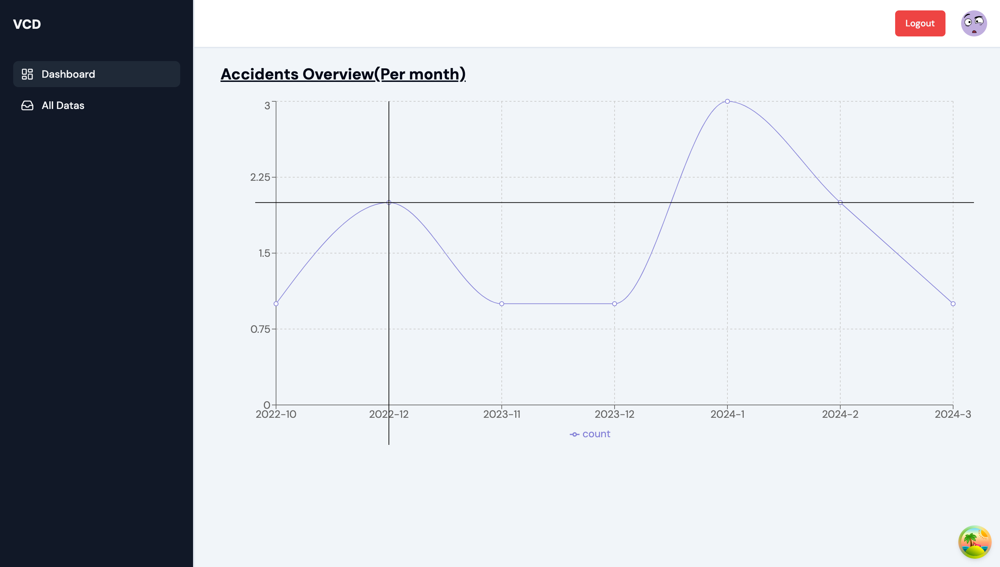
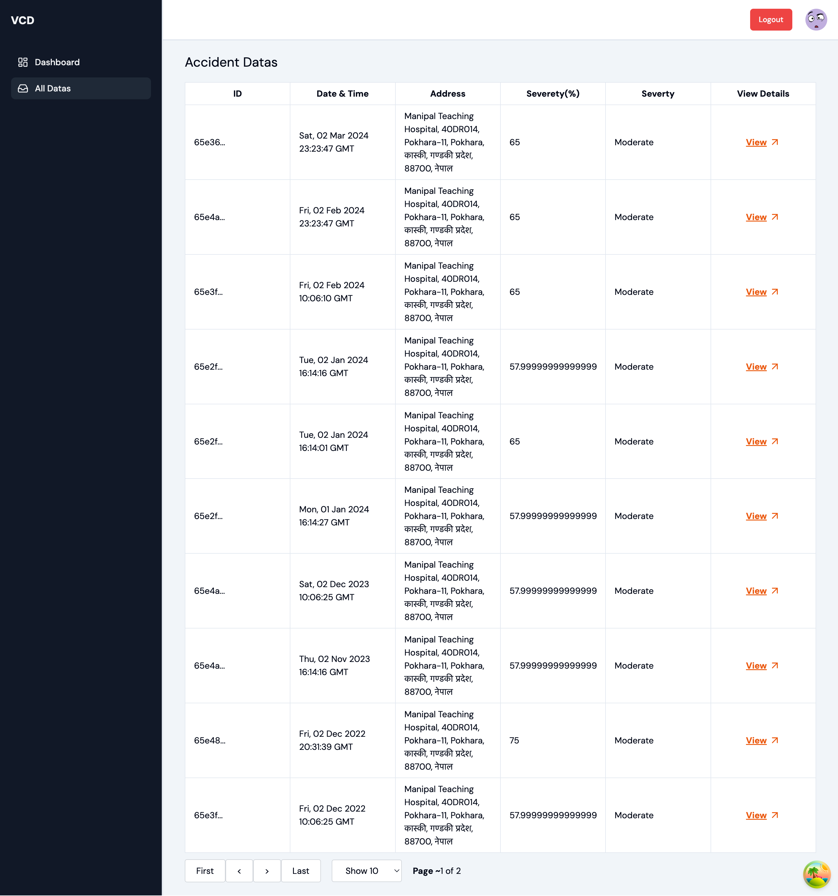
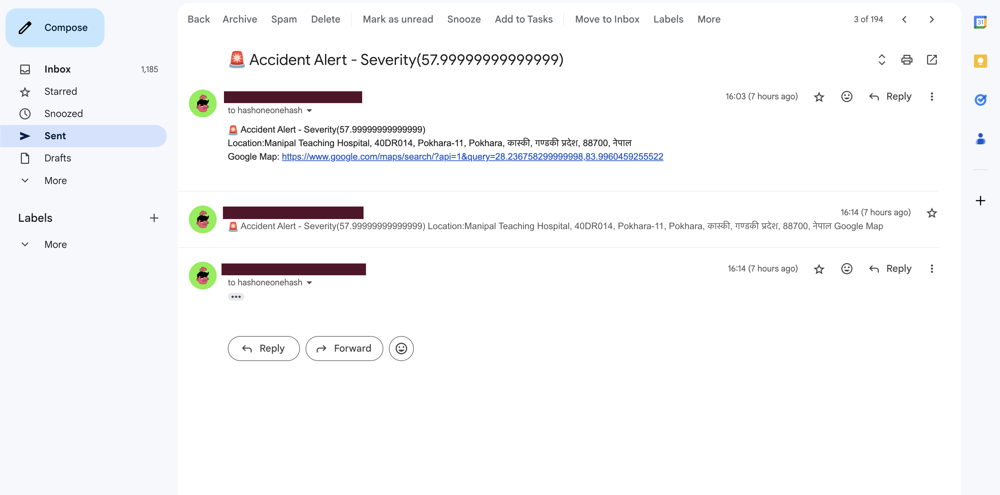

# CNN based Accident Detection and Emergency Response System

A system that will continuously monitor for the accidents through the CCTV or RSTV and deploy emergency services notifying the concerned authorities for the instant rescue.

## Tech Stack Used

- Frontend
  - Next JS v.14
  - Tailwind CSS
  - TypeScript
  - Axios
  - React Query
  - React Hook Form
  - Leaflet
  - Recharts
- Backend
  - Flask
  - Python
  - MongoDB
  - Nodemailer
  - Cloudinary
- ML Model
  - YOLOv8
  - Roboflow

## Setup Guide

1. Firstly clone this repo locally :
   ```
   git clone 
   ```
2. Once cloned successfully, open this project in your IDE

### Backend Setup

1. Once the above steps are done, open the terminal of your IDE and head over to the `server` directory using `cd server`
2. Then we will create the `virutalenv`. To create the `virtualenv` we will use the below command :

   ```
   # For windows
   python -m venv venv

   <!-- OR -->

   # For macos
   python3 -m venv venv


3. Once the `virtualenv` is created, we will activate it using the below command :
   ```
   source venv/bin/activate
   ```
4. And finally we will install the packages which are required for our project using the below command :

   ```
   # For windows
   pip install -r requirements.txt

   <!-- OR -->

   # For macos
   pip3 install -r requirements.txt
   ```

5. Create the `.env` file referencing to the `.env.example` file.
6. As everything is ready now, we can run the backend as

   ```
   # For windows
   python app.py

   <!-- OR -->

   # For macos
   python3 app.py

   ```

### Frontend Setup

The frontend setup is quite easy, unlike backend setup as it does not require any virtual env setup. Let's proceed to frontend setup.

1. Open the new vscode terminal, and head over into the client directory as `cd client` simply run the package installation command as
   ```
   npm install
   ```
2. Once the packages are installed properly, run the frontend application
   ```
   npm run dev
   ```
3. And you can view the page with the url `http://localhost:3000`
4. `Note`: We are using the Nodemailer service in the frontend also, so we need to setup the `.env` file for the frontend too(Reference to `.env.example` file).

## Final Setup(Model Implementor)

1. Setup the virtual environment like in the backend setup(Step 1-4).
2. And then run the application using `python app.py`


## UIS








Direct setup: 
⚙️ Backend Setup
cd server
python -m venv venv
venv\Scripts\activate        # Windows
pip install -r requirements.txt
copy .env.example .env       # edit with your keys
python app.py

Then for register user create new terminal and run 
python register_user.py


📦 Python version: 3.10 – 3.11 works best (Flask + YOLOv8 compatible).

💻 Frontend Setup
cd client
npm install
npm run dev


Then visit http://localhost:3000

🤖 Model Implementor
cd model-implementor
python -m venv venv
venv\Scripts\activate
pip install -r requirements.txt
python app.py