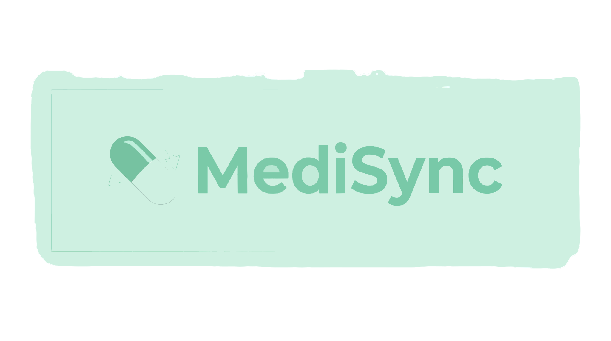

<p align="center">
  
</p>

<h1 align="center">MediSync</h1>
<p align="center">
  <strong>A full-stack medical appointment platform with CNN based Emergency Response System </strong>
</p>

<p align="center">
  
  
  
  
  
  
</p>

---

## What is MediSync?

MediSync is a full-stack healthcare platform built to streamline the entire OPD (Outpatient Department) experience. Patients can browse doctors by speciality, book time slots, manage their appointments, and pay online — all from a single interface. Doctors get their own dashboard to manage schedules and mark appointments complete. Admins have full control over the platform through a dedicated admin panel.

The heart of the project is **God's Eye**, an integrated AI-powered accident detection module using YOLOv8 that can analyse CCTV or uploaded footage and trigger emergency response alerts in real time.

The UI is built with an Awards-inspired design philosophy — mint green & white palette, glassmorphism cards, smooth animations, a custom cursor, and a starry background system.

---

## Features

### Patient Portal
- Register and log in with JWT-based authentication
- Browse all doctors, filter by speciality
- View doctor profiles — degree, experience, fees, about
- Book appointments by selecting a date and 30-minute time slot
- View all upcoming and past appointments
- Cancel appointments with slot release back to the doctor
- Pay appointment fees online via Razorpay
- Manage personal profile — name, phone, address, DOB, gender, profile photo (stored on Cloudinary)

### Doctor Dashboard (Admin Panel)
- Doctors log in via the admin panel
- View all appointments assigned to them
- Mark appointments as completed or cancel them
- View personal dashboard with earnings, patient count, and latest appointments
- Update their own profile information and availability status

### Admin Panel
- Secure admin login
- Add new doctors with full profile details and photo upload
- View and manage all doctors on the platform
- View all appointments across the entire platform
- Cancel any appointment
- Dashboard with platform-wide stats — doctors, patients, appointments, latest bookings

### God's Eye (AI Module)
- YOLOv8-powered vehicle accident detection
- Upload video footage directly from the UI for analysis
- Automatic emergency alert trigger on accident detection
- Accessible via the pulsing "God's Eye" button in the navbar

---

## Tech Stack

| Layer | Technology |
|---|---|
| Frontend | React 18, Vite, Tailwind CSS |
| Admin Panel | React 18, Vite, Tailwind CSS (separate app) |
| Backend | Node.js, Express.js |
| Database | MongoDB with Mongoose ODM |
| Authentication | JSON Web Tokens (JWT) |
| Image Storage | Cloudinary |
| File Uploads | Multer |
| Payments | Razorpay, Stripe |
| Password Hashing | bcrypt |
| AI Detection | YOLOv8 (God's Eye module) |

---

## Project Structure

```
MediSync-full-stack/
│
├── frontend/                        # Patient-facing React app
│   └── src/
│       ├── context/
│       │   ├── AppContext.jsx        # Global state: doctors list, backend URL, currency
│       │   └── UserContext.jsx       # Auth state: token, user data, login/logout
│       ├── pages/
│       │   ├── Home.jsx              # Landing page
│       │   ├── Doctors.jsx           # Browse & filter doctors
│       │   ├── Appointment.jsx       # Book an appointment
│       │   ├── MyAppointments.jsx    # View, cancel, and pay for appointments
│       │   ├── MyProfile.jsx         # View and edit user profile
│       │   ├── Login.jsx             # Login / Sign Up
│       │   ├── About.jsx
│       │   ├── Contact.jsx
│       │   └── GodsEye.jsx           # God's Eye AI module page
│       ├── components/
│       │   ├── Navbar.jsx
│       │   ├── Footer.jsx
│       │   ├── TopDoctors.jsx
│       │   ├── SpecialityMenu.jsx
│       │   ├── RelatedDoctors.jsx
│       │   ├── Banner.jsx
│       │   ├── StarryBackground.jsx
│       │   ├── DecorativeLine.jsx
│       │   ├── CursorAnimation.jsx
│       │   ├── UI/CustomCursor.jsx
│       │   ├── UI/SmoothScroll.jsx
│       │   └── GodsEye/              # God's Eye UI components
│       └── assets/                   # Images, SVGs, icons
│
├── admin/                            # Admin + Doctor dashboard React app
│   └── src/
│       ├── context/
│       │   ├── AdminContext.jsx      # Admin API calls and state
│       │   ├── DoctorContext.jsx     # Doctor API calls and state
│       │   └── AppContext.jsx        # Shared: backend URL, currency
│       ├── pages/
│       │   ├── Admin/
│       │   │   ├── Dashboard.jsx     # Platform-wide stats
│       │   │   ├── AddDoctor.jsx     # Add a new doctor
│       │   │   ├── DoctorsList.jsx   # Manage all doctors
│       │   │   └── AllAppointments.jsx
│       │   ├── Doctor/
│       │   │   ├── DoctorDashboard.jsx
│       │   │   ├── DoctorAppointments.jsx
│       │   │   └── DoctorProfile.jsx
│       │   └── Login.jsx
│       └── components/
│           ├── Navbar.jsx
│           └── Sidebar.jsx
│
└── backend/                          # Express REST API
    ├── server.js                     # Entry point, middleware setup
    ├── config/
    │   ├── mongodb.js                # MongoDB connection
    │   └── cloudinary.js            # Cloudinary configuration
    ├── models/
    │   ├── userModel.js              # Patient schema
    │   ├── doctorModel.js            # Doctor schema
    │   └── appointmentModel.js       # Appointment schema
    ├── controllers/
    │   ├── userController.js         # Patient logic
    │   ├── doctorController.js       # Doctor logic
    │   └── adminController.js        # Admin logic
    ├── routes/
    │   ├── userRoute.js
    │   ├── doctorRoute.js
    │   └── adminRoute.js
    └── middleware/
        ├── authUser.js               # JWT verification for patients
        ├── authDoctor.js             # JWT verification for doctors
        ├── authAdmin.js              # JWT verification for admin
        └── multer.js                 # File upload handling
```

---

## API Reference

### User Routes — `/api/user`

| Method | Endpoint | Auth | Description |
|---|---|---|---|
| POST | `/register` | None | Create a new patient account |
| POST | `/login` | None | Login and receive JWT |
| GET | `/get-profile` | User | Fetch user profile data |
| POST | `/update-profile` | User | Update profile + photo upload |
| POST | `/book-appointment` | User | Book a doctor appointment |
| GET | `/appointments` | User | Get all user appointments |
| POST | `/cancel-appointment` | User | Cancel an appointment |
| POST | `/payment-razorpay` | User | Initiate Razorpay payment |
| POST | `/verifyRazorpay` | User | Verify Razorpay payment |
| POST | `/payment-stripe` | User | Initiate Stripe payment |
| POST | `/verifyStripe` | User | Verify Stripe payment |

### Doctor Routes — `/api/doctor`

| Method | Endpoint | Auth | Description |
|---|---|---|---|
| POST | `/login` | None | Doctor login |
| GET | `/list` | None | Get all doctors (public) |
| GET | `/appointments` | Doctor | Doctor's appointments |
| POST | `/complete-appointment` | Doctor | Mark appointment complete |
| POST | `/cancel-appointment` | Doctor | Cancel appointment |
| GET | `/dashboard` | Doctor | Doctor dashboard stats |
| GET | `/profile` | Doctor | Get doctor profile |
| POST | `/update-profile` | Doctor | Update doctor profile |
| POST | `/change-availability` | Doctor | Toggle availability |

### Admin Routes — `/api/admin`

| Method | Endpoint | Auth | Description |
|---|---|---|---|
| POST | `/login` | None | Admin login |
| POST | `/add-doctor` | Admin | Add a new doctor |
| GET | `/all-doctors` | Admin | Get all doctors |
| POST | `/change-availability` | Admin | Toggle doctor availability |
| GET | `/appointments` | Admin | All appointments platform-wide |
| POST | `/cancel-appointment` | Admin | Cancel any appointment |
| GET | `/dashboard` | Admin | Platform stats |

---

## Database Models

### User
| Field | Type | Notes |
|---|---|---|
| name | String | Required |
| email | String | Required, unique |
| password | String | Hashed with bcrypt |
| image | String | Cloudinary URL |
| phone | String | Default: '000000000' |
| address | Object | `{ line1, line2 }` |
| gender | String | Default: 'Not Selected' |
| dob | String | Date of birth |

### Doctor
| Field | Type | Notes |
|---|---|---|
| name | String | Required |
| email | String | Required, unique |
| password | String | Hashed with bcrypt |
| image | String | Cloudinary URL |
| speciality | String | e.g. 'General physician' |
| degree | String | |
| experience | String | e.g. '5 Years' |
| about | String | |
| available | Boolean | Default: true |
| fees | Number | Appointment fee |
| slots_booked | Object | `{ date: [times] }` |
| address | Object | `{ line1, line2 }` |

### Appointment
| Field | Type | Notes |
|---|---|---|
| userId | String | Reference to User |
| docId | String | Reference to Doctor |
| userData | Object | Snapshot of user at booking |
| docData | Object | Snapshot of doctor at booking |
| slotDate | String | Format: `DD_MM_YYYY` |
| slotTime | String | e.g. `10:30 AM` |
| amount | Number | Fee at time of booking |
| payment | Boolean | Default: false |
| cancelled | Boolean | Default: false |
| isCompleted | Boolean | Default: false |

---

## Local Setup

### Prerequisites
- Node.js v18+
- MongoDB Atlas account (or local MongoDB)
- Cloudinary account
- Razorpay account (optional, for payments)

### 1. Clone the repository
```bash
git clone https://github.com/YashAditya1212/MediSync-full-stack.git
cd MediSync-full-stack
```

### 2. Backend setup
```bash
cd backend
npm install
```

Create a `.env` file in the `backend/` folder:
```env
PORT=4000
MONGODB_URI=your_mongodb_connection_string
JWT_SECRET=your_jwt_secret_key
CLOUDINARY_NAME=your_cloudinary_cloud_name
CLOUDINARY_API_KEY=your_cloudinary_api_key
CLOUDINARY_SECRET_KEY=your_cloudinary_secret_key
ADMIN_EMAIL=admin@medisync.com
ADMIN_PASSWORD=your_admin_password
CURRENCY=INR
RAZORPAY_KEY_ID=your_razorpay_key_id           # optional
RAZORPAY_KEY_SECRET=your_razorpay_key_secret   # optional
STRIPE_SECRET_KEY=your_stripe_secret_key       # optional
```

Start the backend:
```bash
npm run server
```

### 3. Frontend setup
```bash
cd ../frontend
npm install
```

Create a `.env` file in the `frontend/` folder:
```env
VITE_BACKEND_URL=http://localhost:4000
VITE_CURRENCY=₹
VITE_RAZORPAY_KEY_ID=your_razorpay_key_id   # optional
```

Start the frontend:
```bash
npm run dev
```

### 4. Admin panel setup
```bash
cd ../admin
npm install
```

Create a `.env` file in the `admin/` folder:
```env
VITE_BACKEND_URL=http://localhost:4000
VITE_CURRENCY=₹
```

Start the admin panel:
```bash
npm run dev
```

The apps will be running at:
- **Frontend:** http://localhost:5173
- **Admin Panel:** http://localhost:5174
- **Backend API:** http://localhost:4000

---

## Deployment

### Backend → Render
1. Push your code to GitHub
2. Create a new **Web Service** on [Render](https://render.com)
3. Set Build Command: `npm install`
4. Set Start Command: `node server.js`
5. Add all environment variables from your `.env`

### Frontend & Admin → Vercel
1. Import the repo on [Vercel](https://vercel.com)
2. Set the **Root Directory** to `frontend/` (or `admin/` for the admin panel)
3. Add `VITE_BACKEND_URL` pointing to your Render backend URL
4. Both apps include a `vercel.json` for SPA routing — no extra config needed

---

## Author

**Yash Aditya Mishra**  
B.Tech Student | Backend & Cloud Developer  
[GitHub](https://github.com/YashAditya1212)

---

## License

This project is for educational and portfolio purposes. Any commercial use is strictly prohibited.
